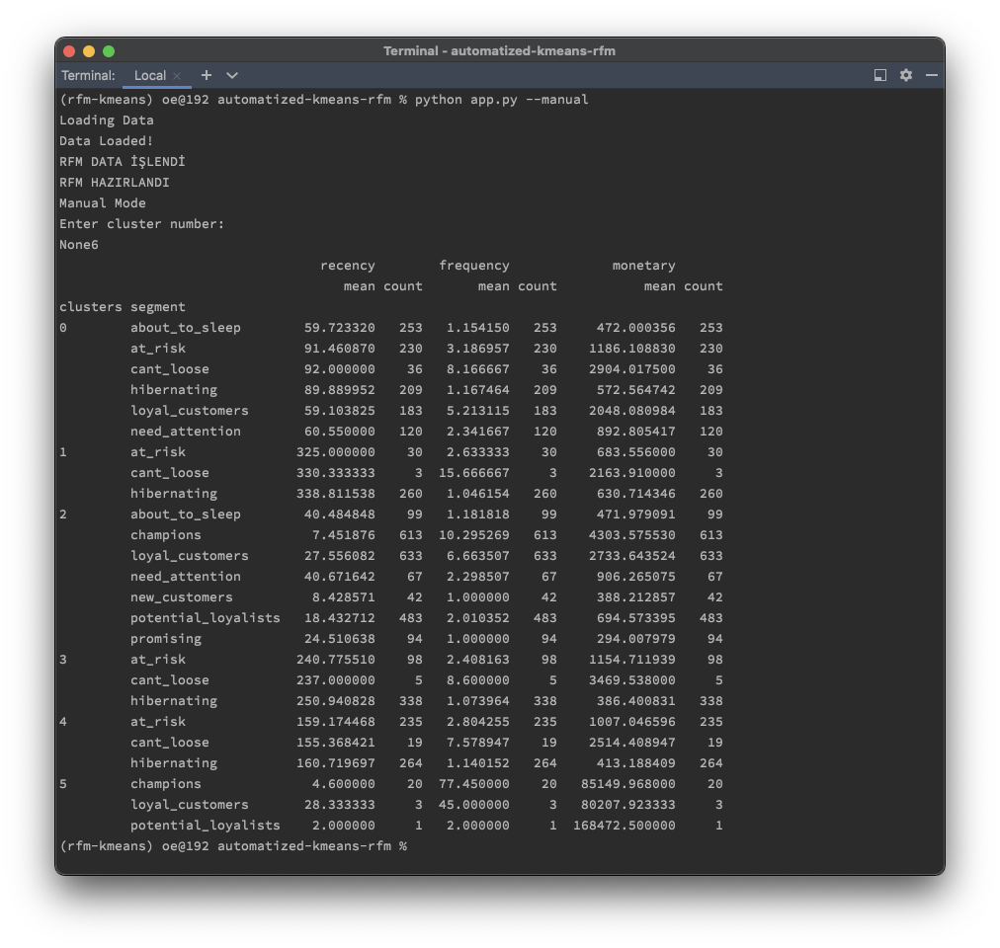

# Automated RFM & K-Means

Automated RFM & KMeans Script

Performs RFM and Kmeans segmentation on your transaction data.



It has two modes, 

- Automatic
- User-defined

### Automatic mode

When you run the **`app.py`** script, it runs with **automatic mode** defaultly.

You don't need to do anything in automatic mode.

Cluster images and segmentation file are uploaded to **outputs** folder.


### User-defined mode

When you run the script with `--manual` parameter, it runs in **manual mode.**

According to an elbow graph you need to specify the input for the number of clusters.


**Sample usage:**

```sql
python app.py --manual
```

**GSheet Uploader Configuration**

You can upload data to your google sheet in the script.

To do this, you need some steps.

First, you have to open and authorize a service account with your own Google account.

You can [check this link](https://mljar.com/blog/authenticate-python-google-sheets-service-account-json-credentials/) for opening service account.

Then download your credentials script and save as `**client-secret.json`** in root folder.

**Folder Tree**

```bash
├── app.py
├── client-secret.json
├── datasets
│   └── data.xlsx
├── outputs
├── requirements.txt
└── scripts
    ├── data_prep.py
    └── loader.py
```

After these steps you have to share your Google Sheet with your service account as Editor.


**Last Step:**

Set your gsheet page in `loader.py`

Write your spreadsheet name and sheet name

```
spreadSheetName = 'Clustering Data' # GSheet Name
sheetName = 'Sayfa1'                # Table name
```

If you have completed all these operations, you can run the script with the '--upload' parameter.

**Sample Usage:**

```bash
python app.py --upload 
```

You can connect your Google sheet to data studio and create a customer segment dashboard.

[You can check mine](https://datastudio.google.com/u/0/reporting/a7baf3c6-832e-4f03-b129-1bc5bd3919be/page/p_i3lyx2tbnc)

**bon appetit!**

---

### Dashboard

**[RFM Section](https://datastudio.google.com/u/0/reporting/a7baf3c6-832e-4f03-b129-1bc5bd3919be/page/p_i3lyx2tbnc)**


**[Cluster Info Section](https://datastudio.google.com/u/0/reporting/a7baf3c6-832e-4f03-b129-1bc5bd3919be/page/36WVC)**


[General Info Section](https://datastudio.google.com/u/0/reporting/a7baf3c6-832e-4f03-b129-1bc5bd3919be/page/tvWVC)


**[Customer Info Section](https://datastudio.google.com/u/0/reporting/a7baf3c6-832e-4f03-b129-1bc5bd3919be/page/l7fVC)**


---

### Usage Modes

```bash
python app.py                       # Automatic mode
python app.py --upload              # Automatic mode and gsheet upload
python app.py --manual              # Manual mode
python app.py --upload --manual     # Manual mode and gsheet upload
```

---

### Requirements

```bash
pandas~=1.4.3
matplotlib~=3.5.3
seaborn~=0.11.2
sklearn~=0.0
scikit-learn~=1.1.2
yellowbrick~=1.5
gspread~=5.4.0
oauth2client~=4.1.3
numpy~=1.23.2
```

---

### Author

[Oğuz Erdoğan](http://www.oguzerdogan.com)